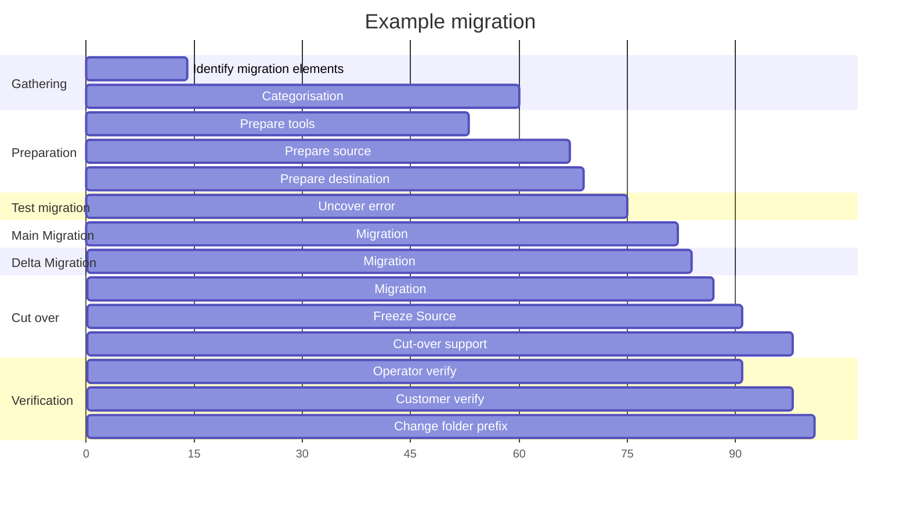

# Public_repo
Public repo for public content

## Migration phases

```mermaid
gantt
    title Example migration
    dateFormat  X
    axisFormat %s

    section Gathering
    Identify migration elements : 0, 14
    Categorisation  : 15, 60
   
    section Preparation
    Prepare tools : 46, 53
    Prepare source: 53, 67
    Prepare destination: 67, 69

    section Test migration
    Uncover error : 70, 75

    section Main Migration
    Migration: 75, 82
 
    section Delta Migration
    Migration : 83, 84

    section Cut over
    Migration : 85, 87
    Freeze Source: 88, 91
    Cut-over support: 91, 98

    section Verification
    Operator verify : 86, 91
    Customer verify : 91, 98
    Change folder prefix : 98, 101
```
